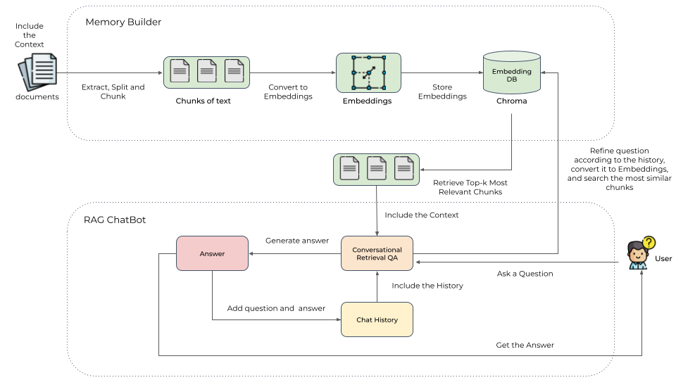
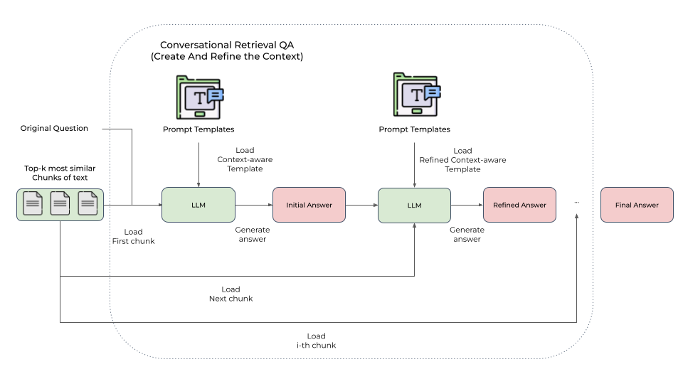
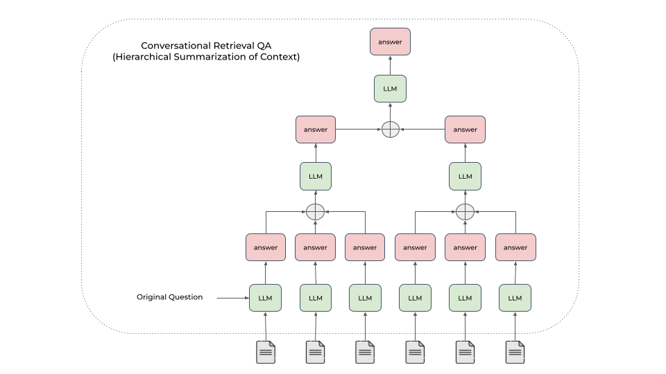
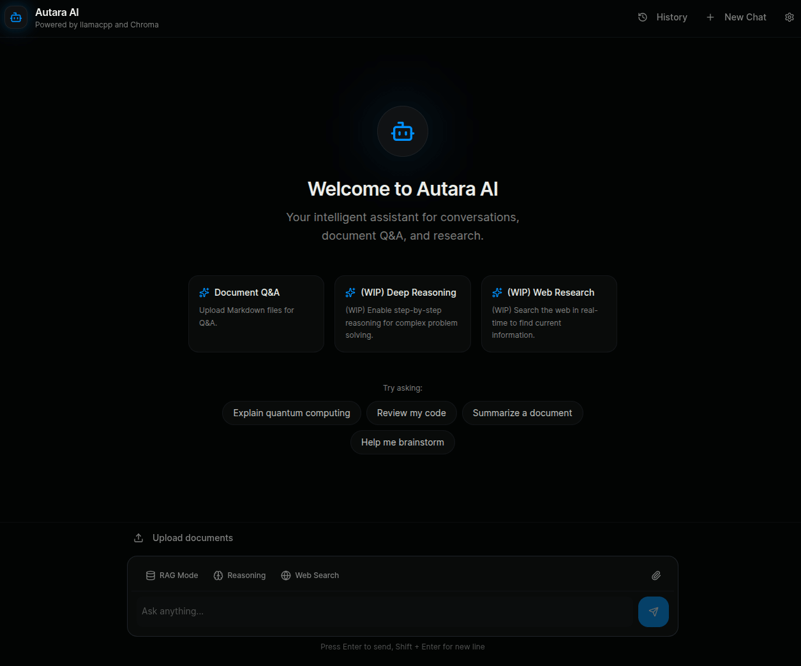
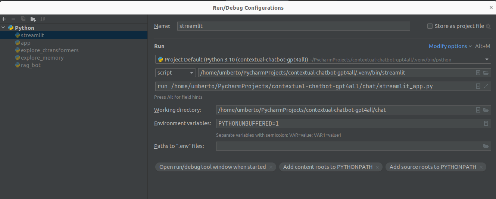

# RAG (Retrieval-augmented generation) ChatBot

[](https://github.com/umbertogriffo/rag-chatbot/actions/workflows/ci.yaml)
[](https://github.com/pre-commit/pre-commit)
[](https://github.com/astral-sh/ruff)

> [!IMPORTANT]
> Disclaimer:
> The code has been tested on:
>   * `Ubuntu 22.04.2 LTS` running on a Lenovo Legion 5 Pro with twenty `12th Gen Intel® Core™ i7-12700H` and
      an `NVIDIA GeForce RTX 3060`.
>   * `MacOS Sonoma 14.3.1` running on a MacBook Pro M1 (2020).
>
> If you are using another Operating System or different hardware, and you can't load the models, please
> take a look at the official Llama Cpp Python's
> GitHub [issue](https://github.com/abetlen/llama-cpp-python/issues).

> [!WARNING]
> - `lama_cpp_pyhon` doesn't use `GPU` on `M1` if you are running an `x86` version of `Python`. More
    info [here](https://github.com/abetlen/llama-cpp-python/issues/756#issuecomment-1870324323).
> - It's important to note that the large language model sometimes generates hallucinations or false information.

## Table of contents

- [Introduction](#introduction)
- [Prerequisites](#prerequisites)
    - [Install Poetry](#install-poetry)
- [Bootstrap Environment](#bootstrap-environment)
    - [How to use the make file](#how-to-use-the-make-file)
- [Using the Open-Source Models Locally](#using-the-open-source-models-locally)
    - [Supported Models](#supported-models)
- [Supported Response Synthesis strategies](#supported-response-synthesis-strategies)
- [Example Data](#example-data)
- [Build the memory index](#build-the-memory-index)
- [Run the Chatbot](#run-the-chatbot)
- [Run the RAG Chatbot](#run-the-rag-chatbot)
- [How to debug the Streamlit app on Pycharm](#how-to-debug-the-streamlit-app-on-pycharm)
- [References](#references)

## Introduction

This project combines the power
of [Lama.cpp](https://github.com/abetlen/llama-cpp-python), [Chroma](https://github.com/chroma-core/chroma)
and [Streamlit](https://discuss.streamlit.io/) to build:

* a Conversation-aware Chatbot (ChatGPT like experience).
* a RAG (Retrieval-augmented generation) ChatBot.

The RAG Chatbot works by taking a collection of Markdown files as input and, when asked a question, provides the
corresponding answer
based on the context provided by those files.



> [!NOTE]
> We decided to grab and refactor the `RecursiveCharacterTextSplitter` class from `LangChain` to effectively chunk
> Markdown files without adding LangChain as a dependency.

The `Memory Builder` component of the project loads Markdown pages from the `docs` folder.
It then divides these pages into smaller sections, calculates the embeddings (a numerical representation) of these
sections with the [all-MiniLM-L6-v2](https://huggingface.co/sentence-transformers/all-MiniLM-L6-v2)
`sentence-transformer`, and saves them in an embedding database called [Chroma](https://github.com/chroma-core/chroma)
for later use.

When a user asks a question, the RAG ChatBot retrieves the most relevant sections from the Embedding database.
Since the original question can't be always optimal to retrieve for the LLM, we first prompt an LLM to rewrite the
question, then conduct retrieval-augmented reading.
The most relevant sections are then used as context to generate the final answer using a local language model (LLM).
Additionally, the chatbot is designed to remember previous interactions. It saves the chat history and considers the
relevant context from previous conversations to provide more accurate answers.

To deal with context overflows, we implemented three approaches:

* `Create And Refine the Context`: synthesize a responses sequentially through all retrieved contents.
    * 
* `Hierarchical Summarization of Context`: generate an answer for each relevant section independently, and then
  hierarchically combine the answers.
    * 
* `Async Hierarchical Summarization of Context`: parallelized version of the Hierarchical Summarization of Context which
  lead to big speedups in response synthesis.

## Prerequisites

* Python 3.10+
* GPU supporting CUDA 12.1+
* Poetry 1.7.0

### Install Poetry

Install Poetry with the official installer by following
this [link](https://python-poetry.org/docs/#installing-with-the-official-installer).

You must use the current adopted version of Poetry
defined [here](https://github.com/umbertogriffo/rag-chatbot/blob/main/version/poetry).

If you have poetry already installed and is not the right version, you can downgrade (or upgrade) poetry through:

```
poetry self update <version>
```

## Bootstrap Environment

To easily install the dependencies we created a make file.

### How to use the make file

> [!IMPORTANT]
> Run `Setup` as your init command (or after `Clean`).

* Check: ```make check```
    * Use it to check that `which pip3` and `which python3` points to the right path.
* Setup:
    * Setup with NVIDIA CUDA acceleration: ```make setup_cuda```
        * Creates an environment and installs all dependencies with NVIDIA CUDA acceleration.
    * Setup with Metal GPU acceleration: ```make setup_metal```
        * Creates an environment and installs all dependencies with Metal GPU acceleration for macOS system only.
* Update: ```make update```
    * Update an environment and installs all updated dependencies.
* Tidy up the code: ```make tidy```
    * Run Ruff check and format.
* Clean: ```make clean```
    * Removes the environment and all cached files.
* Test: ```make test```
    * Runs all tests.
    * Using [pytest](https://pypi.org/project/pytest/)

## Using the Open-Source Models Locally

We utilize the open-source library [llama-cpp-python](https://github.com/abetlen/llama-cpp-python), a binding
for [llama-cpp](https://github.com/ggerganov/llama.cpp),
allowing us to utilize it within a Python environment.
`llama-cpp` serves as a C++ backend designed to work efficiently with transformer-based models.
Running the LLMs architecture on a local PC is impossible due to the large (~7 billion) number of parameters.
This library enable us to run them either on a `CPU` or `GPU`.
Additionally, we use the `Quantization and 4-bit precision` to reduce number of bits required to represent the numbers.
The quantized models are stored in [GGML/GGUF](https://medium.com/@phillipgimmi/what-is-gguf-and-ggml-e364834d241c)
format.

### Supported Models

| 🤖 Model                                                       | Supported | Model Size | Max Context Window | Notes and link to the model card                                                                                                                                     |
|----------------------------------------------------------------|-----------|------------|--------------------|----------------------------------------------------------------------------------------------------------------------------------------------------------------------|
| `llama-3.2` Meta Llama 3.2 Instruct                            | ✅         | 1B         | 128k               | Optimized to run locally on a mobile or edge device - [Card](https://huggingface.co/bartowski/Llama-3.2-1B-Instruct-GGUF)                                            |
| `llama-3.2` Meta Llama 3.2 Instruct                            | ✅         | 3B         | 128k               | Optimized to run locally on a mobile or edge device - [Card](https://huggingface.co/bartowski/Llama-3.2-3B-Instruct-GGUF)                                            |
| `llama-3.1` Meta Llama 3.1 Instruct                            | ✅         | 8B         | 128k               | **Recommended model** [Card](https://huggingface.co/bartowski/Meta-Llama-3.1-8B-Instruct-GGUF)                                                                       |
| `qwen-2.5:3b` - Qwen2.5 Instruct                               | ✅         | 3B         | 128k               | [Card](https://huggingface.co/Qwen/Qwen2.5-3B-Instruct-GGUF)                                                                                                         |
| `qwen-2.5:3b-math-reasoning` - Qwen2.5 Instruct Math Reasoning | ✅         | 3B         | 128k               | [Card](https://huggingface.co/ugriffo/Qwen2.5-3B-Instruct-Math-Reasoning-GGUF)                                                                                       |
| `deep-seek-r1:7b` - DeepSeek R1 Distill Qwen 7B                | ✅         | 7B         | 128k               | **Experimental** [Card](https://huggingface.co/bartowski/DeepSeek-R1-Distill-Qwen-7B-GGUF)                                                                           |
| `openchat-3.6` - OpenChat 3.6                                  | ✅         | 8B         | 8192               | [Card](https://huggingface.co/bartowski/openchat-3.6-8b-20240522-GGUF)                                                                                               |
| `openchat-3.5` - OpenChat 3.5                                  | ✅         | 7B         | 8192               | [Card](https://huggingface.co/TheBloke/openchat-3.5-0106-GGUF)                                                                                                       |
| `starling` Starling Beta                                       | ✅         | 7B         | 8192               | Is trained from `Openchat-3.5-0106`. It's recommended if you prefer more verbosity over OpenChat - [Card](https://huggingface.co/bartowski/Starling-LM-7B-beta-GGUF) |
| `phi-3.5` Phi-3.5 Mini  Instruct                               | ✅         | 3.8B       | 128k               | [Card](https://huggingface.co/MaziyarPanahi/Phi-3.5-mini-instruct-GGUF)                                                                                              |
| `stablelm-zephyr` StableLM Zephyr OpenOrca                     | ✅         | 3B         | 4096               | [Card](https://huggingface.co/TheBloke/stablelm-zephyr-3b-GGUF)                                                                                                      |

## Supported Response Synthesis strategies

| ✨ Response Synthesis strategy                                           | Supported | Notes |
|-------------------------------------------------------------------------|-----------|-------|
| `create-and-refine` Create and Refine                                   | ✅         |       |
| `tree-summarization` Tree Summarization                                 | ✅         |       |
| `async-tree-summarization` - **Recommended** - Async Tree Summarization | ✅         |       |

## Example Data

You could download some Markdown pages from
the [Blendle Employee Handbook](https://blendle.notion.site/Blendle-s-Employee-Handbook-7692ffe24f07450785f093b94bbe1a09)
and put them under `docs`.

## Build the memory index

Run:

```shell
python chatbot/memory_builder.py --chunk-size 1000 --chunk-overlap 50
```

## Run the Chatbot

To interact with a GUI type:

```shell
streamlit run chatbot/chatbot_app.py -- --model llama-3.1 --max-new-tokens 1024
```



## Run the RAG Chatbot

To interact with a GUI type:

```shell
streamlit run chatbot/rag_chatbot_app.py -- --model llama-3.1 --k 2 --synthesis-strategy async-tree-summarization
```


## How to debug the Streamlit app on Pycharm



## References

* Large Language Models (LLMs):
    * [LLMs as a repository of vector programs](https://fchollet.substack.com/p/how-i-think-about-llm-prompt-engineering)
    * [GPT in 60 Lines of NumPy](https://jaykmody.com/blog/gpt-from-scratch/)
    * [Calculating GPU memory for serving LLMs](https://www.substratus.ai/blog/calculating-gpu-memory-for-llm/)
    * [Introduction to Weight Quantization](https://towardsdatascience.com/introduction-to-weight-quantization-2494701b9c0c)
    * [Uncensor any LLM with abliteration](https://huggingface.co/blog/mlabonne/abliteration)
    * [Understanding Multimodal LLMs](https://www.linkedin.com/comm/pulse/understanding-multimodal-llms-sebastian-raschka-phd-t7h5c)
    * [Direct preference optimization (DPO): Complete overview](https://www.superannotate.com/blog/direct-preference-optimization-dpo)
* LLM Frameworks:
    * llama.cpp:
        * [llama.cpp](https://github.com/ggerganov/llama.cpp)
        * [llama-cpp-python](https://github.com/abetlen/llama-cpp-python)
    * Ollama:
        * [Ollama](https://github.com/ollama/ollama/tree/main)
        * [Ollama Python Library](https://github.com/ollama/ollama-python/tree/main)
        * [On the architecture of ollama](https://blog.inoki.cc/2024/04/15/Ollama/)
        * [Analysis of Ollama Architecture and Conversation Processing Flow for AI LLM Tool](https://medium.com/@rifewang/analysis-of-ollama-architecture-and-conversation-processing-flow-for-ai-llm-tool-ead4b9f40975)
        * [How to Customize Ollama’s Storage Directory](https://medium.com/@chhaybunsy/unleash-your-machine-learning-models-how-to-customize-ollamas-storage-directory-c9ea1ea2961a#:~:text=By%20default%2C%20Ollama%20saves%20its,making%20predictions%20or%20further%20training)
        * Use [CodeGPT](https://plugins.jetbrains.com/plugin/21056-codegpt) to access self-hosted models from Ollama for
          a code assistant in PyCharm. More info [here](https://docs.codegpt.ee/providers/local/ollama).
    * Deepval - A framework for evaluating LLMs:
      * https://github.com/confident-ai/deepeval
    * [Structured Outputs](https://github.com/dottxt-ai/outlines)
* LLM Datasets:
    * [High-quality datasets](https://github.com/mlabonne/llm-datasets)
* Agents:
    * [Agents](https://huyenchip.com//2025/01/07/agents.html)
    * [Building effective agents](https://www.anthropic.com/research/building-effective-agents)
* Agent Frameworks:
    * [PydanticAI](https://ai.pydantic.dev/)
    * [Atomic Agents](https://github.com/BrainBlend-AI/atomic-agents)
      * [Want to Build AI Agents? Tired of LangChain, CrewAI, AutoGen & Other AI Agent Frameworks?](https://ai.gopubby.com/want-to-build-ai-agents-c83ab4535411)
    * [agno](https://github.com/agno-agi/agno) - a lightweight, high-performance library for building Agents.
* Embeddings:
    * To find the list of best embeddings models for the retrieval task in your language go to
      the [Massive Text Embedding Benchmark (MTEB) Leaderboard](https://huggingface.co/spaces/mteb/leaderboard)
    * [all-MiniLM-L6-v2](https://huggingface.co/sentence-transformers/all-MiniLM-L6-v2)
        * This is a `sentence-transformers` model: It maps sentences & paragraphs to a 384 dimensional dense vector
          space (Max Tokens 512) and can be used for tasks like classification or semantic search.
* Vector Databases:
    * Indexing algorithms:
        * There are many algorithms for building indexes to optimize vector search. Most vector databases
          implement `Hierarchical Navigable Small World (HNSW)` and/or `Inverted File Index (IVF)`. Here are some great
          articles explaining them, and the trade-off between `speed`, `memory` and `quality`:
            * [Nearest Neighbor Indexes for Similarity Search](https://www.pinecone.io/learn/series/faiss/vector-indexes/)
            * [Hierarchical Navigable Small World (HNSW)](https://towardsdatascience.com/similarity-search-part-4-hierarchical-navigable-small-world-hnsw-2aad4fe87d37)
            * [From NVIDIA - Accelerating Vector Search: Using GPU-Powered Indexes with RAPIDS RAFT](https://developer.nvidia.com/blog/accelerating-vector-search-using-gpu-powered-indexes-with-rapids-raft/)
            * [From NVIDIA - Accelerating Vector Search: Fine-Tuning GPU Index Algorithms](https://developer.nvidia.com/blog/accelerating-vector-search-fine-tuning-gpu-index-algorithms/)
            * > PS: Flat indexes (i.e. no optimisation) can be used to maintain 100% recall and precision, at the
              expense of speed.
    * [Chroma](https://www.trychroma.com/)
        * [chroma](https://github.com/chroma-core/chroma)
    * [Qdrant](https://qdrant.tech/):
        * [Qdrant Internals: Immutable Data Structures](https://qdrant.tech/articles/immutable-data-structures/)
        * [Food Discovery with Qdrant](https://qdrant.tech/articles/new-recommendation-api/#)
* Retrieval Augmented Generation (RAG):
    * [Building A Generative AI Platform](https://huyenchip.com/2024/07/25/genai-platform.html)
    * [Rewrite-Retrieve-Read](https://github.com/langchain-ai/langchain/blob/master/cookbook/rewrite.ipynb)
        * > Because the original query can not be always optimal to retrieve for the LLM, especially in the real world,
          we first prompt an LLM to rewrite the queries, then conduct retrieval-augmented reading.
    * [Rerank](https://txt.cohere.com/rag-chatbot/#implement-reranking)
    * [Building Response Synthesis from Scratch](https://gpt-index.readthedocs.io/en/latest/examples/low_level/response_synthesis.html#)
    * [Conversational awareness](https://langstream.ai/2023/10/13/rag-chatbot-with-conversation/)
    * [RAG is Dead, Again?](https://jina.ai/news/rag-is-dead-again/)
* Chatbot UI:
    * [Streamlit](https://discuss.streamlit.io/):
        * [Build a basic LLM chat app](https://docs.streamlit.io/knowledge-base/tutorials/build-conversational-apps#build-a-chatgpt-like-app)
        * [Layouts and Containers](https://docs.streamlit.io/library/api-reference/layout)
        * [st.chat_message](https://docs.streamlit.io/library/api-reference/chat/st.chat_message)
        * [Add statefulness to apps](https://docs.streamlit.io/library/advanced-features/session-state)
            * [Why session state is not persisting between refresh?](https://discuss.streamlit.io/t/why-session-state-is-not-persisting-between-refresh/32020)
        * [st.cache_resource](https://docs.streamlit.io/library/api-reference/performance/st.cache_resource)
        * [Handling External Command Line Arguments](https://github.com/streamlit/streamlit/issues/337)
    * [Open WebUI](https://github.com/open-webui/open-webui)
        * [Running AI Locally Using Ollama on Ubuntu Linux](https://itsfoss.com/ollama-setup-linux/)
* Text Processing and Cleaning:
    * [clean-text](https://github.com/jfilter/clean-text/tree/main)
    * [Fast Semantic Text Deduplication](https://github.com/MinishLab/semhash)
* Inspirational Open Source Repositories:
    * [lit-gpt](https://github.com/Lightning-AI/lit-gpt)
    * [api-for-open-llm](https://github.com/xusenlinzy/api-for-open-llm)
    * [AnythingLLM](https://useanything.com/)
    * [FastServe - Serve Llama-cpp with FastAPI](https://github.com/aniketmaurya/fastserve)
    * [Alpaca](https://github.com/Jeffser/Alpaca?tab=readme-ov-file)
