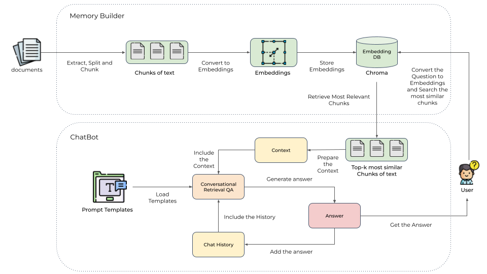

# Contextual ChatBot with GPT4All, LangChain and Chroma

This project combines the power of [LangChain](https://python.langchain.com/docs/get_started/introduction.html),
[GPT4All](https://gpt4all.io/index.html) and [Chroma](https://github.com/chroma-core/chroma) to accomplish a specific task.
It works by taking a collection of Markdown files as input and, when asked a question, provides the corresponding answer
based on the context provided by those files.



The `Memory Builder` component of the project loads Markdown pages from the `docs` folder.
It then divides these pages into smaller sections, calculates the embeddings (a numerical representation) of these
sections with [all-MiniLM-L6-v2](https://huggingface.co/sentence-transformers/all-MiniLM-L6-v2), and saves them in a
database called [Chroma](https://github.com/chroma-core/chroma) for later use.

When a user asks a question, the ChatBot retrieves the most relevant sections from the Embedding database.
These sections are then used as context to generate the final answer using a local language model (LLM).

Additionally, the chatbot is designed to remember previous interactions. It saves the chat history and considers the
relevant context from previous conversations to provide more accurate answers. However, it's important to note that
the GPT4All language model sometimes generates hallucinations or false information.

## Table of contents

- [Prerequisites](#prerequisites)
  - [Install Poetry](#install-poetry)
- [🛠 Bootstrap Environment](#-bootstrap-environment)
  - [How to use the make file](#how-to-use-the-make-file)
- [Using the Open-Source GPT4All Model Locally](#using-the-open-source-gpt4all-model-locally)
  - [Convert the Model](#convert-the-model)
  - [Use the WizardLM's WizardLM 7B GGML](#use-the-wizardlms-wizardlm-7b-ggml)
- [Example Data](#example-data)
- [Build the memory index](#build-the-memory-index)
- [Run a simple Chatbot](#run-a-simple-chatbot)
- [Run the Contextual Chatbot](#run-the-contextual-chatbot)
- [References](#references)


## Prerequisites

Python 3.8+ and Poetry.

### Install Poetry

Install Poetry by following this [link](https://python-poetry.org/docs/).

## 🛠 Bootstrap Environment

To easily install the dependencies I created a make file.

### How to use the make file

* Check: ```make check```
  * Use It to check that `which pip3` and `which python3` points to the right path.
* Install: ```make install```
  * Creates an environment and installs all dependencies.
* Tidy up the code: ```make tidy```
  * Run Isort, Black and Flake8.
* Clean: ```make clean```
  * Removes the environment and all cached files.

**Note:** Run `Install` as your init command (or after `Clean`)

## Using the Open-Source GPT4All Model Locally

We use [GPT4All](https://gpt4all.io/index.html), a model trained on top of Facebook’s LLaMA model, which released its weights under a
non-commercial license. Still, running the mentioned architecture on your local PC is impossible due to the
large (7 billion) number of parameters. The main contribution of GPT4All models is the ability to run them on a CPU.
The authors applied Quantization and 4-bit precision using the GGML format.
So, the model uses fewer bits to represent the numbers.

### Convert the Model

The first step is to download the [weights](https://the-eye.eu/public/AI/models/nomic-ai/gpt4all/) and use a script from the [LLaMAcpp](https://github.com/ggerganov/llama.cpp)
repository to convert the weights from the old format to the new one (ggml-formatted).
It is a required step; otherwise, the `LangChain` library will not identify the checkpoint file.
Use the `download_model.py` Python script to breaks down the file into multiple chunks and downloads them gradually.
This process might take a while since the file size is 4GB.
The `local_path` variable is the destination folder.
`LangChain` library uses [PyLLaMAcpp](https://github.com/abdeladim-s/pyllamacpp) module (`pyllamacpp==1.0.7`) to load the converted `GPT4All` weights.

> Note: The Quantized model works only with `langchain = "^0.0.215"`

### Use the WizardLM's WizardLM 7B GGML

The [WizardLM's WizardLM 7B GGML](https://huggingface.co/TheBloke/wizardLM-7B-GGML) gives better answers and is also quite fast.
To use it you need to download the `ggml-wizardLM-7B.q4_2.bin` from the GPT4ALL website and use `langchain = "^0.0.215"`
to have also backward compatibility with the `gpt4all-lora-quantized-ggml.bin`.

```shell
python download_model.py
```

Transform the downloaded file to the latest format as written in the LLaMAcpp [repo](https://github.com/ggerganov/llama.cpp#using-gpt4all):
```shell
git clone https://github.com/ggerganov/llama.cpp.git
python llama.cpp/convert.py ./models/gpt4all-lora-quantized-ggml.bin
rm -rf llama.cpp
```

## Example Data

You could download some Markdown pages from the [Blendle Employee Handbook](https://blendle.notion.site/Blendle-s-Employee-Handbook-7692ffe24f07450785f093b94bbe1a09) 
and put them under `docs`.

## Build the memory index

Run:
```shell
python chat/memory_builder.py --chunk-size 1000
```

## Run a simple Chatbot

Type:
```shell
python chat/simple_chat.py
```


## Run the Contextual Chatbot

Run:
```shell
python chat/chatbot_memory_streaming.py --k 1 --n-threads 4
```

## References

* [GPT4All](https://github.com/nomic-ai/gpt4all)
* [LangChain](https://python.langchain.com/docs/get_started/introduction.html):
  * [Memory](https://python.langchain.com/docs/modules/memory.html)
  * [MarkdownTextSplitter](https://api.python.langchain.com/en/latest/_modules/langchain/text_splitter.html#MarkdownTextSplitter)
  * [How to customize conversational memory](https://python.langchain.com/docs/modules/memory/how_to/conversational_customization)
  * [Chroma Integration](https://python.langchain.com/docs/modules/data_connection/vectorstores/integrations/chroma)
  * [Conversational Retrieval QA](https://python.langchain.com/docs/modules/chains/popular/chat_vector_db)
  * [Streaming final agent output](https://python.langchain.com/docs/modules/agents/how_to/streaming_stdout_final_only)
  * [FinalStreamingStdOutCallbackHandler](https://python.langchain.com/docs/modules/agents/how_to/streaming_stdout_final_only)
  * [GPT4All](https://python.langchain.com/docs/modules/model_io/models/llms/integrations/gpt4all.html)
    * uses `pyllamacpp`
  * [Llama-cpp](https://python.langchain.com/docs/modules/model_io/models/llms/integrations/llamacpp)
    * uses `llama-cpp-python`
* Embeddings:
  * [all-MiniLM-L6-v2](https://huggingface.co/sentence-transformers/all-MiniLM-L6-v2)
    * This is a `sentence-transformers` model: It maps sentences & paragraphs to a 384 dimensional dense vector space and can be used for tasks like clustering or semantic search.
* Text Cleaning:
  * [clean-text](https://github.com/jfilter/clean-text/tree/main)
* Repos:
  * [llama.cpp](https://github.com/ggerganov/llama.cpp)
  * [pyllamacpp](https://github.com/abdeladim-s/pyllamacpp)
  * [llama-cpp-python](https://github.com/abetlen/llama-cpp-python)
